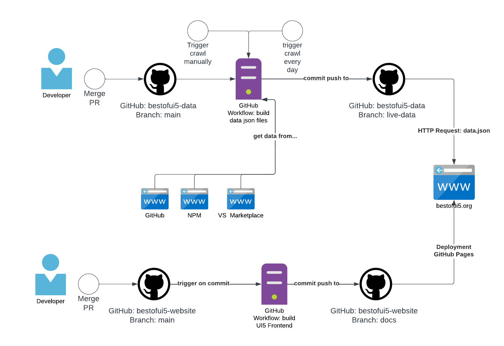

# Best of UI5

"Best of UI5" is the new entry page for the ui5-community.  
It will show the best of community projects, be it applications, libraries, custom controls, tooling extensions, middlewares, tasks or Easy UI5 generators.  
Everyone can be able to register their projects at Best of UI5.  
The projects will be ranked by various information about the projects and filterable by important criteria.  
This should help to find you the best suited reuse project for your development needs!

## Add your package

Just create a [issue with this template in the `bestofui5-data repo`](https://github.com/ui5-community/bestofui5-data/issues/new?assignees=marianfoo&labels=new%20package&template=new_package.md&title=Add%20new%20Package:) with your package and just check if you meet the prerequisites

## Views

### Hot Packages

Overview of the most popular packages.  
The packages are sorted by the growth of downloads in the last 30 days.

### All Packages

You can here search/filter/sort the packages.  
**You can also bookmark your searches. A url could look like this:**  
<https://bestofui5.org/#/packages?search=live&tokens=middleware:type&sort=downloadsCurrentFortnight>

Each packages has metadata added what type it is and what tags are associated with it.  
Data is coming from GitHub, NPM and Visual Studio Marketplace.

The search is divided into three sections:

- search by name and description
- filter by type, tags and license
- sorting

The filter narrows down the results more and more with each selected field.

### Object View

You can click on any package to get more information about it.  
Currently not only npm metadata is displayed, also the readme, historic npm downloads and all versions are displayed.

### Tags

Here are all types and tags list that are used in the packages.  
If you click on a tag, you will see all the packages that have this tag.

### Timeline

The timeline shows the latest changes in the associated NPM packages

### Contribution

This list shows the top contributors to the GitHub packages.

# Technical

## Overview

Here is a diagram that illustrates the architecture of BestOfUI5.  

In short:  
The repository `bestofui5-data` generates the data and serves it to the website, so it is effectively our backend for the website.  
In the repository `bestofui5-website` only the frontend is maintained. This is generated after each commit in `main` branch.  

## Frontend

The frontend is generated with the [UI5-TS-App Generator](https://github.com/ui5-community/generator-ui5-ts-app) and written completly in TypeScript.
In the folder `src` is the source code.

### External Dependencies

We use two external modules (`ui5-cc-md` and `chart.js`) that are integrated in two different ways.

#### `ui5-cc-md`

For each package we load the `README.md` to show it on the object page.  
To render this we use [`ui5-cc-md`](https://github.com/ui5-community/ui5-cc-md) integrated via NPM.  
To use this simply install `ui5-cc-md` and add `ui5-cc-md` to your `package.json` at ["ui5"-->"dependencies"](https://github.com/ui5-community/bestofui5-website/blob/5a33b4b710d8143f1d07195bba9ca28696871995/package.json#L77-L82).  
Now we can use simply use this in the [`Object.view.xml`](https://github.com/ui5-community/bestofui5-website/blob/5a33b4b710d8143f1d07195bba9ca28696871995/src/view/Object.view.xml#L94) to render the markdown.

#### `chart.js`

We also get the historical download data from all npm packages.  
To display this data we use [`chart.js`](https://www.npmjs.com/package/chart.js) in the in the `Object.view.xml`.  
To use this library install via NPM [`ui5-tooling-modules`](https://www.npmjs.com/package/ui5-tooling-modules) and `chart.js`.  
As template to integrate `chart.js` we use almost the same implementation from [@akudev](https://github.com/akudev) in this tutorial:
[ui5-typescript-tutorial - Using NPM Packages](https://github.com/SAP-samples/ui5-typescript-tutorial/tree/main/exercises/ex8)  
For a better usage we create a [custom control](https://github.com/ui5-community/bestofui5-website/blob/main/src/control/BarChart.ts) to use a bar chart.
Now we can use this chart in the [`Object.view.xml#L61-L63`](https://github.com/ui5-community/bestofui5-website/blob/5a33b4b710d8143f1d07195bba9ca28696871995/src/view/Object.view.xml#L83-L85) to display the data.

### UI5 Web Components

Even though the [UI5 Web Components](https://sap.github.io/ui5-webcomponents/) were originally intended for use outside of the UI5 framework, the components are now integrated into the OpenUI5 framework.  
They will replace the standard controls in the long run and therefore it makes sense to use them already.  
As a use case, we wanted to display the individual released versions of the NPM packages sorted by date.  
In [SAPUI5 there is a timeline](https://ui5.sap.com/#/api/sap.suite.ui.commons.Timeline) for this, but unfortunately not in OpenUI5, however in the [UI5 web components](https://sap.github.io/ui5-webcomponents/playground/components/Timeline/) there is.  
To use the UI5 web components, [@petermuessig](https://github.com/petermuessig) has already written a [detailed blog](https://blogs.sap.com/2022/03/10/ui5-web-components-enablement-for-openui5-sapui5/) about it.  
Through direct integration with OpenUI5 the use is as simple as any other control [`Timeline.view.xml#L18-L37`](https://github.com/ui5-community/bestofui5-website/blob/5a33b4b710d8143f1d07195bba9ca28696871995/src/view/Timeline.view.xml#L18-L37)

### Build & Deployment

Build is automated with GitHub Actions.  
On every push to `main`, the [`build`](https://github.com/ui5-community/bestofui5-website/blob/main/.github/workflows/build.yml) workflow is triggered.  
This will transpile typescript to javascript and run `ui5 build self-contained --all`.  
The result will be moved to the new folder [`docs`](https://github.com/ui5-community/bestofui5-website/tree/docs) and force pushed to the `docs` branch.  
From there, GitHub Pages will automatically deploy the new version to the webpage <https://bestofui5.org/> .

### Testing

We run [`wdi5`](https://github.com/js-soft/wdi5) tests on every Pull Request.  
Implicitly, the build is also tested before the wdi5 tests, since it is executed before the tests.  
The tests are located in the [`test`](https://github.com/ui5-community/bestofui5-website/tree/main/src/test) folder.  
We run the tests with [mock data](https://github.com/ui5-community/bestofui5-website/tree/main/src/localService) to make sure we get consistent results on the tests.

## Backend

**The backend is located in a seperate repository [`bestofui5-data`](https://github.com/ui5-community/bestofui5-data#readme).**  
**For a more detailed documentation read the readme there.**

We crawl data from GitHub and NPM.  
The source code is written in typescript and in folder [`src`](https://github.com/ui5-community/bestofui5-data/tree/main/src).
It creates two json files (`data`, `versions`) which will be used as a model in the UI5 App.  
The latest update of the files are located in the [`data`](https://github.com/ui5-community/bestofui5-data/tree/live-data/data) folder on the `live-data` branch.
The frontend is using these raw files [directly from the branch](https://github.com/ui5-community/bestofui5-website/blob/5a33b4b710d8143f1d07195bba9ca28696871995/src/manifest.json#L17-L27).  
The packages are crawled from are located in [`sources.json`](https://github.com/ui5-community/bestofui5-data/blob/main/sources.json).

## DevOps

### Deployment of Pull Requests to Azure Static Web Apps

In order for contributors to better understand the impact of a pull request and to better test it, there is an option to deploy the changes of a pull request into a test environment, using [Azure Static Web Apps](https://azure.microsoft.com/en-en/services/app-service/static/#overview).  
This makes it easy to access and test the app.  
**For security reasons, this only works for pull requests from the `ui5-community` repo.**

#### How To

- **Create**: To initiate the deployment to Azure Static Web Apps, the label `deploy_test` must be assigned to a pull request.  
  - If this was successful, a comment is left in the pull request with the link to the app.  
- **Update**: After the label is added, each commit initiates an update to the Azure Static Web App.
  - If this label is not present on the pull request, the GitHub actions will be skipped every time.  
- **Delete**: If the pull request is closed (manually or via merge), the Azure Static Web App is also deleted.
  -  Do not remove the label, otherwise the app will not be deleted!

## Run local

### Requirements

Either [npm](https://www.npmjs.com/) or [yarn](https://yarnpkg.com/) for dependency management.

git clone:
`> git clone https://github.com/ui5-community/bestofui5-website`

Install:
`> npm install`

Start UI5 App:
`> npm start`

## Changelog

View the [Changelog here](CHANGELOG.md)

## License

This project is licensed under the Apache Software License, version 2.0 except as noted otherwise in the [LICENSE](LICENSE) file.

